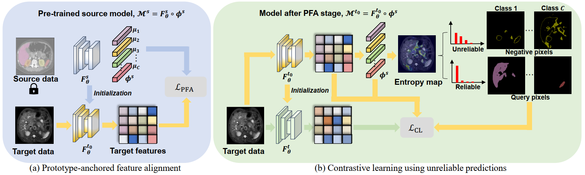

# Proto_Contra_SFDA
## Source-Free Domain Adaptation for Medical Image Segmentation via Prototype-Anchored Feature Alignment and Contrastive Learning

This is an official implementation of MICCAI 2023 paper [Source-Free Domain Adaptation for Medical Image Segmentation via Prototype-Anchored Feature Alignment and Contrastive Learning.] (https://arxiv.org/abs/2307.09769)



### Requirements
- Linux with Python ≥ **3.7**
- PyTorch ≥ **1.7.1** and [torchvision](https://github.com/pytorch/vision/) matches the PyTorch insallation. Install them following the official instructions from [pytorch.org](https://pytorch.org) to make sure of this.

### Quick start
##### 1. Clone repository.
```
git clone https://github.com/CSCYQJ/MICCAI23-ProtoContra-SFDA
cd MICCAI23-ProtoContra-SFDA
```

##### 2. Download Data.

Both datasets are public available. CT modality data is from [MICCAI 2015 Multi-Atlas Abdomen Labeling Challenge](https://www.synapse.org/#!Synapse:syn3193805/wiki/217789). MRI modality data is from [2019 CHAOS Challenge](https://chaos.grand-challenge.org/).

##### 3. Source Model Training.
```
python main_trainer_source.py --config_file configs/train_source_seg.yaml --gpu_id 0
```

##### 4. Target Domain Adaptaion PFA Stage.
```
python main_trainer_sfda.py --config_file configs/train_target_adapt_PFA.yaml --gpu_id 0
```
##### 5. Target Domain Adaptaion CL Stage.
```
python main_trainer_sfda.py --config_file configs/train_target_adapt_CL.yaml --gpu_id 0
```

### Citation
If you find this work or code is helpful in your research, please cite:
```
@article{yu2023source,
  title={Source-Free Domain Adaptation for Medical Image Segmentation via Prototype-Anchored Feature Alignment and Contrastive Learning},
  author={Yu, Qinji and Xi, Nan and Yuan, Junsong and Zhou, Ziyu and Dang, Kang and Ding, Xiaowei},
  journal={arXiv preprint arXiv:2307.09769},
  year={2023}
}
```

### Acknowledgement

Many thanks to these excellent opensource projects 
* [PCT](https://github.com/korawat-tanwisuth/Proto_DA) 
* [U2PL](https://haochen-wang409.github.io/U2PL)